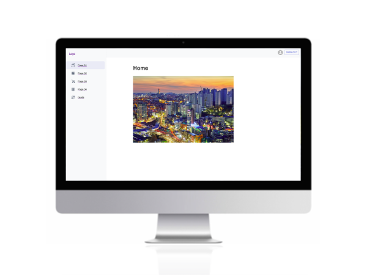
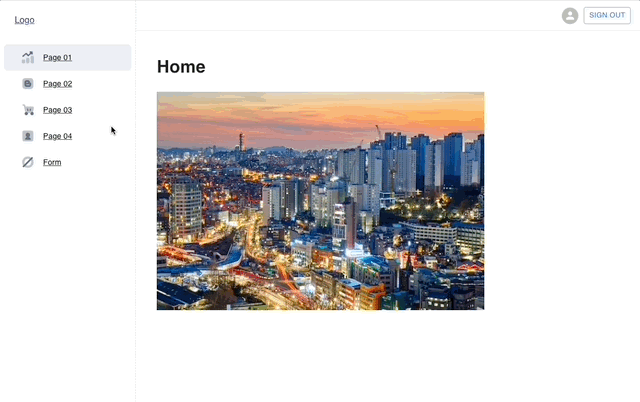
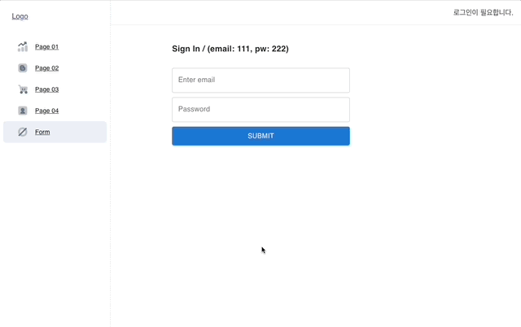

# Boiler Plate
 

 
<a display="block" href="#">hhttps://github.com/KimByul1225/byul_boilerplate</a>
  

 

## 화면구성 🖥

 

## Stacks 🧑🏻‍💻
### Environment

### Config
        
### Development
 

![Recoil](https://img.shields.io/badge/recoil-3578e5?style=for-the-badge&logo=data:image/svg+xml;base64,PHN2ZyB4bWxucz0iaHR0cDovL3d3dy53My5vcmcvMjAwMC9zdmciIHdpZHRoPSI2MDAiIGhlaWdodD0iNjAwIiB2aWV3Qm94PSIwIDAgNjAwIDYwMCI+PGxpbmsgeG1sbnM9IiIgdHlwZT0idGV4dC9jc3MiIGlkPSJkYXJrLW1vZGUiIHJlbD0ic3R5bGVzaGVldCIgaHJlZj0iIi8+PGcgZmlsbD0id2hpdGUiPjxwYXRoIGQ9Ik0xNDIuNTM2IDE5OC44NThjMCAyNi4zNi0yMS4zNjggNDcuNzItNDcuNzIgNDcuNzItMjYuMzYgMC00Ny43MjItMjEuMzYtNDcuNzIyLTQ3LjcyczIxLjM2LTQ3LjcyIDQ3LjcyLTQ3LjcyYzI2LjM1NSAwIDQ3LjcyMiAyMS4zNiA0Ny43MjIgNDcuNzIiLz48cGF0aCBkPSJNNTA1LjE4IDQxNC4yMjVIMjM4LjEyNGMtMzUuMjUgMC02My45MjYtMjguNjc0LTYzLjkyNi02My45MjNzMjguNjc4LTYzLjkyNiA2My45MjYtNjMuOTI2aDEyMC43OGMyMC44MTYgMCAzNy43NTMtMTYuOTM4IDM3Ljc1My0zNy43NTZzLTE2LjkzOC0zNy43NTYtMzcuNzUzLTM3Ljc1Nkg5NC44MWMtNy4yMjcgMC0xMy4wODYtNS44Ni0xMy4wODYtMTMuMDg1IDAtNy4yMjcgNS44Ni0xMy4wODYgMTMuMDg1LTEzLjA4NmgyNjQuMDkzYzM1LjI1IDAgNjMuOTIzIDI4LjY3OCA2My45MjMgNjMuOTI2cy0yOC42NzQgNjMuOTIzLTYzLjkyMyA2My45MjNoLTEyMC43OGMtMjAuODIgMC0zNy43NTYgMTYuOTM4LTM3Ljc1NiAzNy43NiAwIDIwLjgxNiAxNi45MzggMzcuNzUzIDM3Ljc1NiAzNy43NTNINTA1LjE4YzcuMjI3IDAgMTMuMDg2IDUuODYgMTMuMDg2IDEzLjA4NSAwIDcuMjI2LTUuODU4IDEzLjA4NS0xMy4wODUgMTMuMDg1eiIvPjxwYXRoIGQ9Ik00NTcuNDY0IDQwMS4xNDJjMC0yNi4zNiAyMS4zNi00Ny43MiA0Ny43Mi00Ny43MnM0Ny43MiAyMS4zNiA0Ny43MiA0Ny43Mi0yMS4zNiA0Ny43Mi00Ny43MiA0Ny43Mi00Ny43Mi0yMS4zNi00Ny43Mi00Ny43MiIvPjwvZz48c3R5bGUgeG1sbnM9IiIgaWQ9ImRhcmstbW9kZS1jdXN0b20tY29sb3IiPgoJCTpyb290ewoJCQktLWJnLWNvbG9yOnJnYmEoMjYsMjYsMjYsMSk7CgkJCS0tdGV4dC1jb2xvcjpyZ2JhKDExMCwxMTAsMTEwLDEpOwoJCQktLWEtY29sb3I6cmdiYSg5MCwxMjAsMTIwLDEpOwoJCQktLWEtdmlzaXRlZC1jb2xvcjpyZ2JhKDEyMCwxMjAsOTAsMSk7CgkJCS0tYS1ob3Zlci1jb2xvcjpyZ2JhKDIxMSwyMTEsMjExLDEpOwoJCQktLWlucHV0LWJvcmRlci1jb2xvcjpyZ2JhKDIxMSwyMTEsMjExLDAuMik7CgkJCS0taW5wdXQtcGxhY2Vob2xkZXItY29sb3I6cmdiYSgxNzMsMjE2LDIzMCwxKTsKCQkJLS1kaWFsb2ctYmctY29sb3I6cmdiYSgzNiwzNiwzNiwwLjk1KTsKCQkJLS1iZy1pbWFnZTpsaW5lYXItZ3JhZGllbnQocmdiYSgyNiwyNiwyNiwxKSxyZ2JhKDI2LDI2LDI2LDEpKTsKCQl9Cgk8L3N0eWxlPjwvc3ZnPg==)
 
### Style
 

![Emotion](https://img.shields.io/badge/Emotion-D26AC2?style=for-the-badge&logo=data:image/png;base64,iVBORw0KGgoAAAANSUhEUgAAADIAAAAyCAYAAAAeP4ixAAAABGdBTUEAALGPC/xhBQAAAAFzUkdCAK7OHOkAAAAgY0hSTQAAeiYAAICEAAD6AAAAgOgAAHUwAADqYAAAOpgAABdwnLpRPAAABwBJREFUaIHFmnuw1VUVxz+LxwVUiIcChoJgAzEmSQzmjJppxShBKKKmpljR4FQjlpOTTmpOmZZN0+uPasayRitzRqcokjDjUTZgKhEmEEaGJcZDRN4X7qc/9r7x83TO+Z1z7wHWzJ17fue391r7u9fa67VP0AJSAc4C5gCTgUFAH2Af8B/gb8AKYAmwPiJ2tEJuS0lFvUndbTm1qxvUB9RJR3vtbyD1InVPAyAq6YD6hHqJ2vNo40D9RRdAFGm3+pA6To2jBWKwurqbQDppo3qF6bwdMQC91OvU7S0CUaS71f5HAkQf9Utqx2EAYeb7oHrM4QTRQ73jMAGopAfUtsMFZKa68wgBUf222qPVIHqq6+sI7VC3tRjIQfXmVgO5tAHB09TvqvtaCGa3Oqpsfc2o7fIGxmyLiLnAecDCJnjXo37AvbYiaJrc7V9Kdu51dWxhzpvUe9S9XdTEdnVLQSsTWwFkoPqvEsFPqgMq5vVUbzDZerN0QP2KaYNUv9MKIMPVrVWEFRPF2+vM/3xeWLO0WJ1tSjYPqqMPF5Bb8/8OdVyd+b3UX6q71H80AWSPOkG9JYP5ot1JYdQh6qYKIS+o/U1a+WoDPAZkEHerfyrwKTO7H5hKhY+aSoAx3QFyTGZSpC+ooa5RhzbI52oPZbqvZT71YpPqS4X5V6hXdQdIqM8UmO80aamPOr4JPj3zBvRXp5vizWqTo6hHg7q8+CqL+E2B8dPd4DNE7Z3/fmI6e7NLgNQ8f53UTEDcWPj8QvMQEkXE1ohoj4h24NN5DRtJdX0t6lXGtxkgxcW/VHNUExQRLwPfACYBP6sz9NUyXs0Aebbw+fUm5pXRg8BQYD7QUeX9LuCVMibNAFkM7M2f+zYxr4zWA/cDL1J9538XEQfLmDQMJCL2AM/kx4bcbYN8jYjngNeAHcAmDml8P3BPI3yaLVo6NfKOJuc1ynsX8AdgXf5uPvBkS6WoZ5jSBE3R+LSWCkgyVqifMwXJbepJjc5tSCNqL+DLHHKDPYBPNL/UUtpBOvCnACsjoiXe8X9kSi0q64p16rEtlnOBujTz32wrmw/qeKtnvu3qlBpzuirrWt/YZprRrcUXGI8zdQDNNlvZVVzTql1TT8taKNLibNbdYjzMlKo/r96mnmz1ntZNdrNlYyqLq2XB+9X3dRdIz+Ju5+cVFYI6TPXIdXaxAW0q2h6rMKnt6jKTd1xnK7uO6qcqQPxW/WzetTvVq9Q+TfIcZ8qq365er76SeW9ST1c/pP5Tvbe7Wu8UeI2HvNYBU+9qpHqjOs9UvQ1W56rnlAEy1SPXqOeqg9SPqVMzj29mLd+Wx/ZQx1rSDio1B1NF9i1gNSmOLCCl3NuAZcBB4GvAHaRcaSzw8fz+EeCvEdGRTW8iMJWUetwXEVsLcsYAFwKLMo95EVHVK3YVyBhSvfA2oDOaPxURawtj+gFGxN78PB1YA3wAOJEU5NpJ6cYqYEJE/KqKLIApwHHA86T7yAURsaVRQGVgJqs3qx9Uh5WM7WMd/6/2U2eW8BiTZY1Wr1RHlq2x9ACpZwAzSTe0j1FeG8wE/l7rZc6isf5lzovABmAG8BBwvnpiPaF1g43aF7iElJVOItnwfvXPwOPA0xGxq2JaG7CW+vRrUpl7V0FWGzAamEDqHbeRcq8fAc8Bw4CXazFsyPdn2x0KvBUYRTov7wF6A58BHo+Ijjz2nUDfiFhSh9+7SQ3vVabIfQFwLjAGOJ5U98zPAAYCs4DfAysiomr+UxVI9tknk7QwmmROG0gH8NWIMHuh04E7gTcDNwLLs4e6DFhY7YcB2UTOB35KOszTgBF5LV8nFVUDImJlxby3kDzeamBZbl7UpxyIzlZPKIvYpog/Q12eA2NbjjGX1Rh/eY4dH84x4351YqccdZE6p8bcHuqp6ifVwcV3tQ77emBzRGyupcpOioiDEfFz4FpgJCnm9Ab2qSdULOQcUqyZRdLKKuAjEfFs1vL1pJ+CLK8hroNkfquA7Y0AWQlcVA9AFUBrgXkkE7mBZIqVWjmFdGjPI5nWfYWzdRzJPNuBs2qkJFfnNS/tnFcXSA5sS9RZTYLZQfJGe4C5wEZ1RF7oNOAk4FJgfkQsqNB2G2kDBwK3AMM7X5ia2DOBLZnH/7nuqkCyK5wAjFKPbxLMTtKh7UdqUrxfHQKcCbwX+DHwcJV524BbAYHvA/8uvH4XyRUvBB4FplRqrJZpnQ38keTD55Qd+CqL2kTqIE4FjgVmk3ZyKfBIpVkU6GLgKeB7EUmkOhwYDzwREZ2AO0jetDapI9QrC8+nmmr2pusN07XbD7MnWmTJ9YP6sHpm4blNvb1StukqcHo9Rr1ybtOj4vuZduEy0nSv8qh6l3phA+MHVTxPVifXGHtx8fm/RQENgR8rewMAAAAASUVORK5CYII=)
### Configuration Management & Deploy

    
 

## Project Detail 💻
### 1. Layout 분리.
- 추후 프로젝트를 위한 Boiler Plate Code로 Header, Side Menu, Container 영역을 분리해서 구현.

 

### 2. 로그인, 로그아웃 기능.
- 추후 프로젝트를 위한 Boiler Plate Code로 Api연동 없이 Sample Code로 로그인, 로그아웃 구현.
- React Hook Form을 이용한 유효성 검사.
- React Toastify를 사용해 Alert 메세지 구현.
- 비로그인 상태일경우 메뉴 접근 제한 구현.

 

### 3. 각종 Form타입 Sample 준비.
- 자주사용하는 Form타입에 대해 추후 재사용 할 수 있도록 각각 Form타입별로 Component 분리.

 

